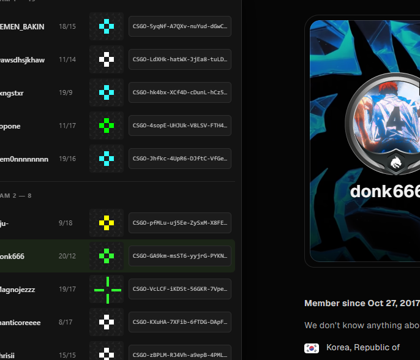

# FACEIT Crosshair Peek

A Chrome extension that shows every player's CS2 crosshair when you hover a match on a
FACEIT profile — rendered, not just the share code.

FACEIT already stores each player's crosshair per match, but it's buried: open the
match room, switch to Stats, switch to the Advanced tab, and copy a code that means
nothing until you paste it into the game. This puts the rendered crosshair one hover
away, for all ten players at once.



## Install (unpacked)

1. Clone or download this repo.
2. Chrome → `chrome://extensions` → toggle **Developer mode** on (top right).
3. **Load unpacked** → select the `src/` folder.
4. Open any profile, e.g. `https://www.faceit.com/en/players/donk666`, and hover one of
   the recent matches — or the full history at
   `https://www.faceit.com/en/players/donk666/cs2/history`.

There is no build step. `src/` is the extension.

## How it works

Two public FACEIT endpoints, no auth, no API key, no scraping of the match page:

```
GET /api/statistics/v1/cs2/matches/{matchId}/match-rounds/1/scoreboard-summary?statsType=2
    → payload.cs2.teams[].players[].crosshair      "CSGO-xxxxx-xxxxx-xxxxx-xxxxx-xxxxx"

GET /api/match/v4/match/{matchId}
    → payload.teams.{faction1,faction2}.roster[]   nicknames, avatars
```

`statsType=1` is the General tab and carries no crosshair field; `statsType=2` is the
Advanced tab and does. Match IDs come straight out of the page DOM
(`a[href*="/cs2/room/"]`), which is the same row link on the overview and the history, so a
hover costs exactly one round trip. Responses are cached per match ID for the life of the page.

Decoding and drawing live in `src/crosshairRenderer.js`, which implements the real CS2
pixel math (`yresScale = height / 480`, round-to-even bar sizing) rather than
approximating it — so the preview matches what the player actually sees at 1080p.

## Footprint

The extension is scoped to `https://www.faceit.com/*` and cannot run on any other site —
Chrome never injects it elsewhere. It has no background service worker, no storage, no
permissions block and no telemetry, so an idle tab runs nothing.

Within faceit.com it has to be injected on every page, because the site is an SPA and a
narrower match pattern would never fire when you click through to a profile. It compensates
at runtime: listeners are attached only while you are actually on a player profile and
removed again when you leave, and the only network requests are the two made when you hover
a match row. Responses are cached per match ID and die with the tab.

## Known quirks

- **Not every match has advanced stats.** FACEIT only has crosshairs where the demo was
  parsed. Those matches show "no advanced stats for this match".
- **The API returns two key casings.** Some matches come back `playerId` / `elo_delta`,
  others `player_id` / `eloDelta`. `pick()` in `content.js` reads both. Don't "clean this
  up" — it will silently break on roughly half of all matches.
- **`cl_crosshairstyle` 0 and 1** are the legacy dynamic styles and can't be drawn
  statically; they render as "dynamic".
- **Codes that fail to decode** — wrong shape, or a checksum mismatch — render as "invalid
  code" rather than a crosshair. The underlying decoder silently substitutes its own defaults
  in that case, and showing those would mean displaying a crosshair that isn't the player's.
- **FACEIT's CSS classes are hashed** (`styles__MatchLink-sc-cf17d301-9`) and change every
  deploy. Nothing here depends on them — the only selector is the `href` shape.

## Tuning

In `src/content.js`:

| Constant | Default | What it does |
| --- | --- | --- |
| `RENDER_SCALE` | `5` | CSS upscale of the pixel-exact canvas |
| `REFERENCE_HEIGHT` | `1080` | Game resolution the crosshair is drawn for |
| `HOVER_DELAY_MS` | `180` | Delay before firing the request on hover |

## License

GPL-3.0-or-later. See [LICENSE](LICENSE).

This is not a choice about openness so much as a consequence: `src/crosshairRenderer.js`
is derived from [girlglock/cs2-crosshair](https://github.com/girlglock/cs2-crosshair),
which is GPL-3, so the combined work is GPL-3 too. See [THIRD-PARTY.md](THIRD-PARTY.md).

Not affiliated with FACEIT or Valve. Counter-Strike is a trademark of Valve Corporation.
